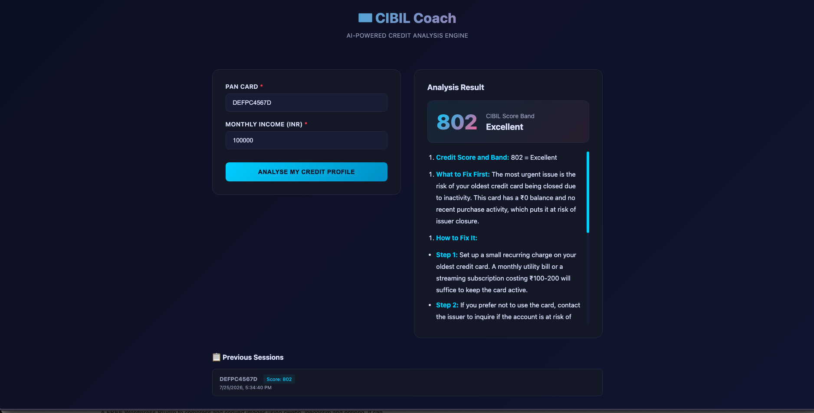
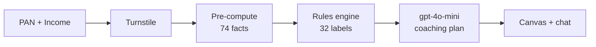

# Zynx AI — CIBIL Credit Coach

Your CIBIL score, explained in plain English. With a plan to fix it.



## What it does

Enter your PAN and monthly income. Get a full picture of your credit health and a personalised plan to improve it — in under 5 seconds.

- **Your score, with a band** (Poor → Excellent)
- **What's hurting you**, ranked by severity
- **A 3-action plan** with concrete numbers and a horizon for each

## A real example: Priya S. from Hyderabad

**Priya, 28.** Marketing manager. Monthly income ₹75,000.

> "I always pay on time, so why did my score drop from 740 to 715?"

She opened the app, typed her PAN, and got this:

```
Score:               715 / 900  (Good)
3-month trend:       740 → 730 → 715   (falling, -25 points)
Overall utilisation: 57.2%
Hard inquiries:      3 in the last 6 months (rate shopping)
Collections:         1 on file
On-time streak:      24 months across all 4 accounts
```

### The plan she got back

> **Action 1 — Pay the HDFC Millennia balance down to 30%**
>
> You owe ₹39,200 on a ₹56,000 limit. That's 70% — the highest on any card.
> CIBIL penalises anything over 30% aggressively. Bring the balance down to
> ₹16,800 (₹22,400 less than today) and your overall utilisation drops from
> 57% to about 30%.
> **You'll see the bump in 1-2 billing cycles.**

> **Action 2 — Pause new credit applications for 4-6 months**
>
> You have 3 hard inquiries on your file from the last 6 months. That's
> rate-shopping, and the cluster is dragging you down roughly 15 points.
> Wait until the oldest inquiry ages past 6 months before the next
> application.
> **You'll see the bump 6 months from your last application.**

> **Action 3 — Keep your 24-month on-time streak going**
>
> This is your strongest asset. You've paid every account on time for
> 24 months straight. Set up autopay on all 4 accounts so a busy week
> can't break the streak. One missed payment would cost 50-100 points.

> **Bonus — what's already working**
>
> Your 0.7% debt-to-income ratio is excellent. Your mix of credit cards
> plus an auto loan is well-balanced. No tax liens, no bankruptcies, no
> public records to address.

That's the whole plan. Three numbers to change, three timelines.

## How to use it

1. Pick a PAN from the dropdown (or type your own — must be 10 characters)
2. Enter your monthly income in ₹
3. Click **Analyze**

The canvas (charts) appears in under a second. The coaching plan streams in 2-4 seconds after.

## Privacy

- Your PAN is masked (`ABCDE****A`) before any AI sees it
- The AI never sees your name, full PAN, or any address
- Conversations are not stored on our servers
- Bot protection (Cloudflare Turnstile) gates the API

---

## How it works (for developers)

Deployed on **Vercel** + **Supabase** + **Cloudflare Turnstile** + **LangSmith**. **OpenAI gpt-4o-mini** generates the plan. Backend is Python 3.12 FastAPI, frontend is React 19 + Vite.

### Pipeline



1. **Turnstile** — invisible bot check; the request is rejected with HTTP 403 if the token is invalid. First step, before any expensive work.
2. **Pre-compute** — 74 deterministic facts about the customer (utilisation, trend, payment streak, DTI, …) computed in pure Python from the SanitisedRecord.
3. **Rules engine** — fires the relevant subset of 32 KB labels (e.g. `high_overall_utilization`, `rate_shopping_pattern`, `current_streak_24mo`).
4. **LLM** — the prompt bundles the labels + facts + KB mitigation steps; gpt-4o-mini streams back a structured CoachPlan JSON. LangSmith auto-traces every call.
5. **Verifier** — checks that the numbers in the plan (₹ amounts, %) match the precomputed facts exactly.
6. **Canvas** — the deterministic payload (score, utilisation, heatmap, labels) is sent to the browser as the first SSE frame, so charts render before the LLM finishes.

### Tech stack

| Layer | What |
|---|---|
| Frontend | React 19, Vite, TypeScript, Recharts, Framer Motion, KaTeX |
| Backend | Python 3.12, FastAPI, SQLAlchemy 2 |
| Database | Supabase Postgres (production) / SQLite (local dev) |
| LLM | OpenAI gpt-4o-mini via LangChain |
| Observability | LangSmith (auto-traces every LLM call) |
| Bot protection | Cloudflare Turnstile (invisible) |
| Deploy | Vercel (Python serverless function + static frontend) |

## License

[Add your license here — MIT / Apache 2.0 / etc.]
